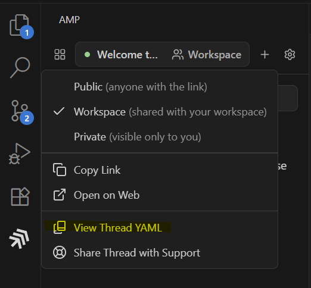

# 🛠️ System Prompts of AI Tools & Products
**The ultimate collection of system prompts powering AI developer tools**

[](https://github.com/aliii-codes/System-Prompts-of-all-ai-tools-and-products/stargazers)
[](https://github.com/aliii-codes/System-Prompts-of-all-ai-tools-and-products/network)
[](https://github.com/aliii-codes/System-Prompts-of-all-ai-tools-and-products/issues)
[](LICENSE.md)


## ✨ Highlights
- **Comprehensive Collection**: System prompts from leading AI coding tools
- **Multi-Format**: JSON, YAML, and Markdown files
- **Tool-Specific Configurations**: Includes tool-specific settings and examples
- **Community-Driven**: Contributions welcome for new tools and updates

## 📋 Features
| Feature | Description |
| --- | --- |
| **Extensive Coverage** | Prompts for tools like Amp, Cursor, Leap.new, and more |
| **Version Control** | Track changes and improvements in system prompts |
| **Tool Integration** | Includes tool-specific configurations and examples |
| **Community Contributions** | Open to contributions for new tools and updates |

## 🖼️ Preview

*Amp's system prompt in YAML format*

## 🛠️ Tech Stack
| Category | Technologies |
| --- | --- |
| **Markup Languages** |    |
| **Version Control** |  |

## 🚀 Installation
1. Clone the repository:
   ```bash
   git clone https://github.com/aliii-codes/System-Prompts-of-all-ai-tools-and-products.git
   ```
2. Navigate to the project directory:
   ```bash
   cd System-Prompts-of-all-ai-tools-and-products
   ```

## 🛠️ Usage
- Explore the `Amp`, `Cursor Prompts`, `Leap.new`, etc. directories for tool-specific prompts.
- Use the provided JSON, YAML, and Markdown files as references or templates.

## 📁 Project Structure
```
System-Prompts-of-all-ai-tools-and-products/
├── Amp/
│   ├── README.md
│   ├── claude-4-sonnet.yaml
│   └── gpt-5.yaml
├── Augment Code/
│   ├── claude-4-sonnet-tools.json
│   └── gpt-5-tools.json
├── Comet Assistant/
│   └── tools.json
├── Cursor Prompts/
│   └── Agent Tools v1.0.json
├── Emergent/
│   └── Tools.json
├── Leap.new/
│   └── tools.json
└── Lovable/
    └── Agent Tools.json
```

## 🤝 Contributing
1. Fork the repository.
2. Create a new branch:
   ```bash
   git checkout -b feature/new-tool
   ```
3. Commit your changes:
   ```bash
   git commit -m "Add system prompt for [Tool Name]"
   ```
4. Push to the branch:
   ```bash
   git push origin feature/new-tool
   ```
5. Open a pull request.

## 🐞 Bug Reports & Feature Requests
[Open an issue](https://github.com/aliii-codes/System-Prompts-of-all-ai-tools-and-products/issues/new) with details about the bug or feature request.

## 📜 License
This project is licensed under the MIT License - see the [LICENSE.md](LICENSE.md) file for details.

## 🎉 Acknowledgements
- Thanks to the developers and communities behind the AI tools included in this repository.
- Special thanks to contributors who help keep this collection up-to-date and comprehensive.
